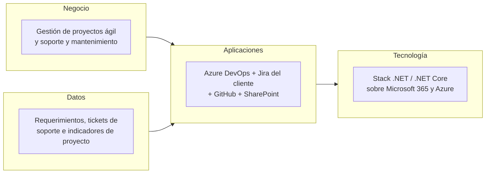

# 📄 Documento de Visión de Arquitectura

## 🔖 Cliente
Asul Tecnologías de la Información SAS.

## 👥 Integrantes del equipo
- Mao Suárez
- Nicolas Clavijo

## 🗺️ Mapa conceptual de alto nivel

> 4 cajas grandes (negocio, datos, aplicaciones, tecnología) — sin el nivel de detalle del BPMN o el ERD, que se desarrollan en los Talleres 1 y 2.

## 🚀 Beneficios esperados

| Objetivo estratégico (Ficha) | Beneficio esperado | Cómo se mide |
|---|---|---|
| Mantener la viabilidad económica de la empresa | Estimaciones de desarrollo más confiables, con menor desviación entre horas aprobadas y horas reales por sprint | % de desviación entre horas estimadas y horas reales por proyecto |
| Incrementar la satisfacción y fidelización de los clientes | Menos retrabajo por bugs de entendimiento y ciclos de soporte más ágiles al reducir la transcripción manual Jira ↔ Azure DevOps | Número de bugs de entendimiento por proyecto; tiempo promedio de cierre de un ticket de soporte |
| Fortalecer la competitividad del producto (seguridad, estabilidad, confiabilidad) | Trazabilidad end-to-end entre requerimiento firmado, tarea de desarrollo y ticket de soporte | % de tickets con trazabilidad completa entre Jira y Azure DevOps |
| Brindar condiciones de trabajo que favorezcan el desarrollo profesional | Menos carga operativa manual (transcripción de tickets, documentación extensa de requisitos) liberando tiempo del equipo para tareas de mayor valor | Horas/mes dedicadas a tareas de transcripción manual entre herramientas |

## 🧭 Alcance

| En alcance | Fuera de alcance |
|---|---|
| Modelado AS-IS del proceso de desarrollo y soporte, y del proceso de escalamiento de tickets Cliente–Jira–Azure DevOps (Taller 1) | Reemplazo de Azure DevOps o de Jira por otra herramienta (restricción de la Ficha) |
| Modelo de información unificado (ERD + diagrama de contexto) del dominio de proyectos, requerimientos y soporte (Taller 2) | Implementación real de la integración o del sistema (el curso entrega el diseño, no lo construye) |
| Propuesta TO-BE de automatización de la sincronización Jira–Azure DevOps y de la documentación de requerimientos, en talleres posteriores | Procesos de gestión financiera, talento humano y comercial de Asul (fuera del proceso operativo evaluado) |

## 💡 Justificación

Los cuatro objetivos estratégicos de Asul giran alrededor de dos tensiones: mantener la calidad y la relación con el cliente sin sacrificar la eficiencia operativa, y hacerlo con un equipo de menos de diez personas. Los tres problemas identificados en la Ficha —estimaciones poco confiables, falta de automatización y duplicidad de trabajo en soporte, y bugs originados en supuestos no validados— no son fallas aisladas de herramientas, sino síntomas de un mismo patrón: la información crítica del proyecto (requerimientos, tickets, horas) se transcribe manualmente entre sistemas que no están integrados, lo que multiplica el riesgo de error y el desgaste del equipo.

La visión propuesta no busca reemplazar el stack tecnológico de Asul —eso violaría la restricción explícita de mantener Azure DevOps y el ecosistema Microsoft sobre el que están construidas sus certificaciones (ITMark, CMMI, ISO 29110)— sino documentar con precisión dónde ocurre hoy la fricción (la frontera Jira–Azure DevOps, y la frontera Requerimientos–Desarrollo) para que las propuestas de automatización de talleres posteriores tengan un punto de partida verificado con el proceso real, no con supuestos.

Por eso el alcance de este taller se limita deliberadamente a levantar y modelar el AS-IS: el Taller 1 documenta el proceso de desarrollo y soporte de punta a punta, y el Taller 2 estructura la información que fluye por ese proceso. Ambos alimentan directamente los objetivos de "viabilidad económica" (mejores estimaciones) y "satisfacción del cliente" (menos reproceso), que son los que el cliente mencionó como más urgentes durante la reunión de levantamiento.

---

_Este documento hace parte de la entrega del Taller 0 del curso AREM (Arquitectura Empresarial) - Universidad de La Sabana._
