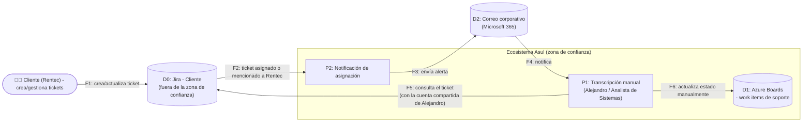

# 📄 Informe Técnico del Taller

## 🔖 Nombre del Taller
Taller 5 - Evaluación de Seguridad con STRIDE

## 👥 Integrantes del equipo
- Mao Suárez
- Nicolas Clavijo

## 🧠 Descripción general del trabajo

El objetivo del taller era aplicar el marco STRIDE sobre un flujo crítico del sistema real de Asul, priorizando amenazas por riesgo. Se eligió el flujo de **gestión de un ticket de soporte del cliente**, porque es el punto de la arquitectura donde ya se habían identificado, en las Fases 03 y 04, dos condiciones agravantes: una sincronización 100% manual entre sistemas (Fase 03) y una fuerte dependencia de una sola persona para operarlo (Fase 04). Este taller confirmó, además, un tercer hallazgo no visto antes: el acceso a Azure DevOps del lado de Asul se hace con **una sola cuenta compartida**, entregada por el cliente.

## 🔧 Proceso de desarrollo

Se aplicaron los 5 pasos de la guía metodológica:

1. **Elegir el flujo y dibujar su DFD** — se modeló el flujo de sincronización de un ticket de soporte entre el Jira del cliente y Azure Boards de Asul (ver diagrama abajo).
2. **Identificar los elementos a analizar** — el sistema Jira (fuera de la zona de confianza de Asul), el proceso de transcripción manual, Azure Boards como almacén de datos, y el canal de notificación por correo.
3. **Aplicar las 6 categorías STRIDE** — se revisó cada elemento del DFD y, adicionalmente, cada componente sensible identificado en las Fases 03/04 (usuario compartido, despliegue manual, backups, retención de código, roles), para no limitar el análisis solo al flujo dibujado.
4. **Evaluar impacto y proponer mitigación** — para cada amenaza se documentó impacto, probabilidad, controles ya existentes (cuando los hay) y una mitigación concreta.
5. **Priorizar por riesgo** — la tabla se ordenó de mayor a menor riesgo (ver `tabla-stride-cliente.xlsx`).

### Diagrama de Flujo de Datos (DFD)

## 🧩 Análisis del modelo propuesto

El DFD deja ver dos límites de confianza relevantes: el primero, ya conocido, es la frontera Jira–Azure Boards (Fase 03); el segundo, nuevo en este taller, es que **quien transcribe del lado de Asul lo hace con la única cuenta que el cliente entregó** (la de Alejandro) — es decir que el propio proceso de mitigar el problema de integración (revisar el correo y actualizar Jira) se apoya en una identidad compartida, sin registro individual de quién hizo cada consulta o cambio del lado del cliente.

De las 6 categorías STRIDE, las más representadas en los hallazgos de Asul son **Spoofing/Repudiation** (por la cuenta compartida) y **Denial of Service** (por la dependencia de una persona para desplegar, y por el respaldo semanal de SharePoint) — es decir, los riesgos de Asul hoy son menos sobre "ataques externos sofisticados" y más sobre **higiene de identidad y continuidad operativa**, coherente con que la entrevista no reportó incidentes de seguridad en los últimos años ni un compromiso conocido.

**Actualización (octubre 2026):** se confirmó directamente con el cliente que el MFA/segundo factor de autenticación está habilitado en todas las cuentas de Microsoft 365/Azure. La amenaza R2 (Spoofing sobre cuentas de Microsoft 365/Entra ID) queda cerrada en `tabla-stride-cliente.xlsx`, con nivel de riesgo residual bajo en vez de alto. El hallazgo de identidad que sigue abierto es exclusivamente R1 (la cuenta compartida de Azure DevOps entregada por el cliente), que es un problema de licenciamiento del cliente y no de configuración de Asul, por lo que el MFA no lo resuelve.

**Supuestos tomados:**
- El flujo de "punto más sensible de inseguridad" en la cadena Jira→Azure DevOps→SharePoint fue preguntado directamente en la entrevista, pero la respuesta se desvió hacia la pregunta de usuarios compartidos; por eso este informe no reporta una única "amenaza más sensible" declarada por el cliente, sino el conjunto priorizado en la tabla STRIDE, construido por el equipo a partir de todo lo levantado en las Fases 03 a 05.
- El control de seguridad de tráfico sospechoso mencionado en la entrevista (un "SOC/NOC" transcrito de forma imprecisa) se documentó como un control que aplica al ambiente del cliente y no directamente al de Asul; se incluyó en la tabla (R9) por su relevancia para la disponibilidad del ambiente que Asul administra, marcado como pendiente de confirmar la terminología exacta.
- No se realizó el reconocimiento pasivo autorizado sobre un sistema propio de Asul (sección 5 de la guía de clase) porque el alcance de esta entrevista fue exclusivamente el levantamiento verbal con el cliente; queda como actividad pendiente antes de la sustentación si el curso lo exige.

## 📈 Diagrama final entregado

Ver el DFD en Mermaid más arriba y la tabla completa en [`tabla-stride-cliente.xlsx`](tabla-stride-cliente.xlsx) (9 amenazas identificadas, columnas según la plantilla oficial del taller).

## 📋 Tabla de actores, entidades o componentes

| Nombre del elemento | Tipo | Descripción | Responsable |
|---|---|---|---|
| Cliente (Rentec) | Actor externo | Crea y gestiona tickets de soporte en su Jira | Cliente de Asul |
| Jira (Cliente) | Almacén de datos externo | Sistema de tickets fuera de la zona de confianza de Asul | Cliente de Asul |
| Azure Boards | Almacén de datos | Registro de work items de soporte y desarrollo de Asul | Asul |
| Transcripción manual | Proceso | Alejandro / Analista de Sistemas revisan el correo y actualizan Azure Boards | Asul |
| Correo corporativo | Almacén de datos | Canal de notificación cuando un ticket se asigna o menciona a Rentec | Asul |
| Cuenta compartida de Azure DevOps | Activo crítico | Única licencia entregada por el cliente, usada por todo el lado de soporte de Asul | Asul / Cliente |

## 🔍 Investigación complementaria

### Tema investigado:
Riesgos de seguridad asociados al uso de cuentas compartidas ("credential sharing") en herramientas de gestión de trabajo, y su relación con la categoría Repudiation de STRIDE.

### Resumen:
OWASP y el propio marco STRIDE (Microsoft, *The STRIDE Threat Model*, 2009) señalan que compartir credenciales entre varias personas rompe la trazabilidad individual necesaria para responder a un incidente ("¿quién hizo este cambio?"), incluso cuando la plataforma sí registra un historial de auditoría — porque ese historial queda atribuido a una sola identidad técnica, no a la persona real que actuó. Esto es exactamente el caso de Asul: Azure DevOps sí guarda historial de quién modificó un work item, pero como varias personas usan la cuenta de Alejandro, ese historial no permite distinguir cuál de ellas hizo el cambio. La causa raíz reportada por el equipo no es negligencia sino una restricción de licenciamiento del cliente (solo entregó una licencia), lo que convierte la mitigación en una negociación comercial, no solo en un cambio técnico — un matiz relevante para priorizar la recomendación frente a la gerencia de Asul.

## 📚 Referencias
- [1] Microsoft. *The STRIDE Threat Model*. https://learn.microsoft.com/previous-versions/commerce-server/ee823878(v=cs.20)
- [2] OWASP. *Threat Modeling Cheat Sheet*. https://cheatsheetseries.owasp.org/cheatsheets/Threat_Modeling_Cheat_Sheet.html
- [3] Shostack, A. *Threat Modeling: Designing for Security*. Wiley, 2014.
- [4] Barrera Díaz, Luz Miryan / Suárez, Alejandro. *Reunión de levantamiento de información — Talleres 3 a 6, Asul Tecnologías de la Información SAS*. Transcripción de reunión, septiembre de 2026. Fuente primaria del equipo.
- [5] Fuente asistida por IA: Claude (Anthropic), septiembre 2026 — apoyo en la construcción del DFD, la tabla STRIDE y la redacción de este informe.

---

_Este documento hace parte de la entrega del Taller 5 del curso AREM (Arquitectura Empresarial) - Universidad de La Sabana._
